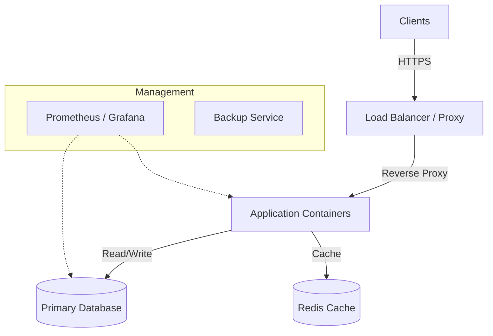

# Architecture Overview

General system architecture and component interactions.

## High-Level Design

## Components

1. **Edge Layer (Nginx/Traefik):** Handles SSL termination and routing.
2. **Application Layer (Docker):** Stateless containers running business logic.
3. **Data Layer (PostgreSQL/MySQL):** Persistent storage with volume management.
4. **Caching (Redis):** Session and transient data storage.
